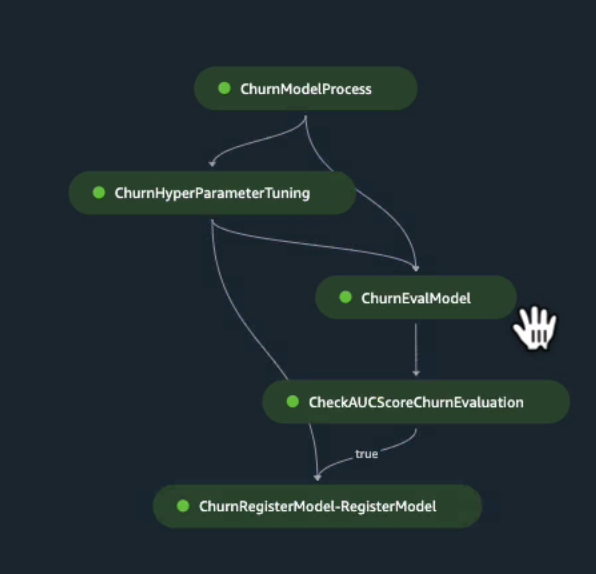
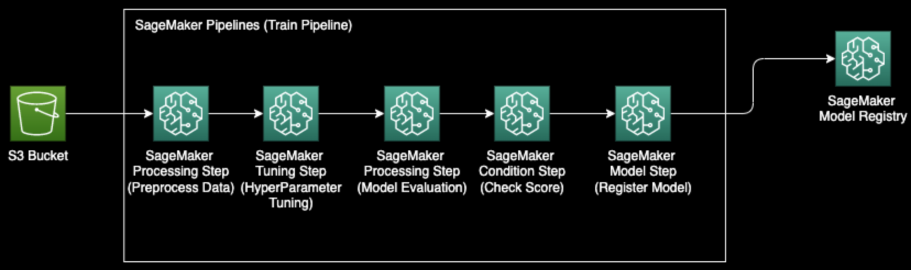

# Prediction System - SafeGuard Bank


**SafeGuard Bank**, a trusted institution in the financial sector, has long been committed to serving its valued customers with dedication and reliability. In today's dynamic and competitive banking landscape, customer retention has emerged as a strategic imperative. With an ever-evolving financial ecosystem and an array of choices available to customers, SafeGuard Bank recognizes the pressing need to stay ahead of the curve. 

This recognition led to the development of an advanced Churn Prediction System. By harnessing the power of data and machine learning, SafeGuard Bank aims to proactively identify customers at risk of churning – those contemplating the shift to other financial providers. This predictive system not only underscores SafeGuard Bank's commitment to personalized customer service but also empowers the institution to take proactive measures to retain valued clients. T

he Churn Prediction System is poised to enhance customer engagement, enabling SafeGuard Bank to tailor its services, offer timely incentives, and address customer concerns, ultimately ensuring a seamless and mutually beneficial banking experience for all.

## SageMaker Workflow


## SageMaker Pipeline


## Project Overview

Welcome to the Customer Churn Prediction project for SafeGuard Bank. In this project, we develop and deploy a machine learning model to predict customer churn, a critical challenge faced by many businesses, including SafeGuard Bank. We utilize AWS SageMaker pipelines for building and deploying the model, demonstrating the power of Infrastructure as Code (IaC) with Terraform for AWS resource provisioning.

## Project Structure

### `data` Directory
- **images**: This folder contains image files used in your project, including logos and visualization outputs.
- **intermediate**: This directory may contain intermediate data files generated during data processing or transformations.
- **raw**: This directory stores raw data files, such as Excel spreadsheets and archived model files.

### `docs` Directory
- This directory is be used to store project documentation or additional resources.

### `LICENSE` File
- This file typically contains the license information for your project, specifying how others can use and distribute your code.

### `notebooks` Directory
- This directory holds Jupyter notebooks that may include code, documentation, and explanations. In this case, it contains notebooks for inference and training pipelines.

### `secrets` Directory
- This directory could store sensitive information or secrets used in your project. It's important to keep such data secure.

### `src` Directory
- **evaluate-churn.py**: This Python script is likely used for evaluating churn predictions or related tasks.
- **install_dependencies.sh**: A shell script for installing project dependencies.
- **preprocess-churn.py**: This script is likely used for preprocessing data related to churn prediction.
- **requirements.txt**: A file containing a list of project dependencies and their versions.

### `terraform` Directory
- This directory appears to be part of an Infrastructure as Code (IaC) setup using Terraform, which defines the infrastructure for your project.
- **main.tf**: The main Terraform configuration file.
- **sagemaker**: A subdirectory that likely contains Terraform configuration specific to Amazon SageMaker resources.
    - **notebook-instance**: Terraform configuration for SageMaker notebook instances.
    - **sagemaker-domain**: Configuration for the SageMaker domain.
    - **sagemaker-execution-role**: Configuration for the SageMaker execution role.
    - **sagemaker-user-profile**: Configuration for SageMaker user profiles.


```plaintext
├── data
│   ├── images
│   │   ├── SAFEGUARD.png
│   │   ├── sagemaker-pipeline-1.png
│   │   └── sagemaker-pipeline.png
│   ├── intermediate
│   │   └── store_data.csv
│   └── raw
│       ├── customer-retention-model.tar.gz
│       └── storedata_total.xlsx
├── docs
├── LICENSE
├── notebooks
│   ├── inference-pipeline.ipynb
│   └── train-pipeline.ipynb
├── README.md
├── secrets
├── src
│   ├── evaluate-churn.py
│   ├── install_dependencies.sh
│   ├── preprocess-churn.py
│   └── requirements.txt
└── terraform
    ├── main.tf
    └── sagemaker
        ├── notebook-instance
        │   └── main.tf
        ├── sagemaker-domain
        │   ├── main.tf
        │   ├── outputs.tf
        │   └── variables.tf
        ├── sagemaker-execution-role
        │   ├── main.tf
        │   ├── outputs.tf
        │   └── variables.tf
        └── sagemaker-user-profile
            ├── main.tf
            ├── outputs.tf
            └── variables.tf
```

## Usage

To effectively utilize this Churn Prediction System, follow these steps:

### 1. Clone the Repository
First, clone this GitHub repository to your local environment or AWS SageMaker instance. Open a terminal and run:

```bash
git clone https://github.com/your-username/sagemaker-pipeline.git
cd sagemaker-pipeline
```

### 2. Running Notebooks on AWS SageMaker

To leverage the power of Amazon SageMaker for running the provided Jupyter notebooks, follow these steps:

**a. Sign in to AWS SageMaker**

Ensure you have an AWS account and access to the AWS Management Console.

**b. Create a SageMaker Notebook Instance**

1. Navigate to the SageMaker.
2. Click on "Notebook instances".
3. Click "Create notebook instance."
4. Provide a name, choose an instance type, and select an IAM role with necessary permissions.
5. Optionally, configure Git repositories or attach EFS storage.
6. Click "Create notebook instance."

**c. Accessing Notebooks**

1. Once the notebook instance status is "InService," click "Open Jupyter."
2. In the Jupyter interface, navigate to the cloned repository directory (sagemaker-pipeline/notebooks).
3. Open and run the desired notebook (e.g., `inference-pipeline.ipynb` or `rain-pipeline.ipynb`).

### 3. Follow the notebook instructions

Each notebook contains step-by-step instructions and explanations. Execute the code cells and follow along with the documentation to train models or perform churn predictions effectively.

### 4. Customize and Experiment
Feel free to customize the notebooks, tweak hyperparameters, or modify the project to suit your specific needs. Remember to save your changes and push them back to your forked repository if necessary.

By following these steps, you can harness the capabilities of AWS SageMaker to run and experiment with the Churn Prediction System effortlessly.

## License

This project is licensed under the **GNU General Public License v3.0**.

- For a summary of the license terms, please visit the [GNU GPL-3.0 Summary](https://www.gnu.org/licenses/gpl-3.0.en.html).

- To view the full text of the license, see the [GNU General Public License v3.0](LICENSE) file in the project repository.

By using or contributing to this project, you agree to comply with the terms and conditions of the GNU GPL-3.0 license.
